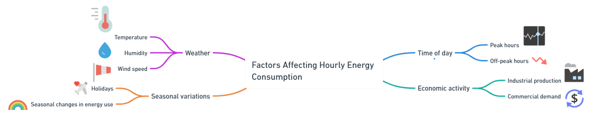
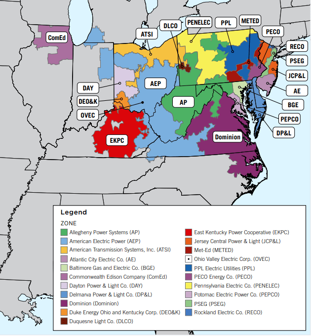

# 🗼⚡ **Energy Consumption Forecasting and Causal machine learning Project**

## Overview
The following project explores forecasting energy consumptions through machine learning approaches. The dataset is collected from Kaggle and contains information on several United States based power companies and their energy consumption across a number of years.
This set of companies fall under the PJM
## Objective
The main goal of this project is to answer important business decision:
- Adopt the CRISP-DM Project Management approach.
- Analyze historical energy consumption data.
- Analyze **ComED** data the power company that services northern Illinois, including the Chicago metropolitan area.

- Apply machine learning techniques to forecast energy usage trends.
- Apply Causal machine learning to learn of causations between exisiting features and response variables.
- Identify key patterns and insights in energy consumption across various power companies

## Dataset
The dataset used in this project is sourced from Kaggle. It includes detailed information on:
- Energy consumption by different United States-based power companies.
- Temporal data spanning multiple years.
- Energy consumption is the feature relevant to forecasting energy trends.
- [Kaggle Dataset](https://www.kaggle.com/datasets/robikscube/hourly-energy-consumption)
### What does PJM stand for?
In 1927, three utilities in New Jersey and Pennsylvania formed an integrated power pool to maximize the benefits and efficiencies that come from sharing generating resources via interconnected high voltage power lines. 

In 1956, additional utilities in Pennsylvania and New Jersey, as well as utilities in Maryland, joined the power pool and PJM (PJM stands for Pennsylvania-New Jersey-Maryland) was born.  

Today, PJM has evolved into a regional transmission organization (RTO), and it includes more than 1,100 member utilities serving more than 65 million people. An independent nonprofit organization, PJM territory spans nearly 369,000 square miles and includes all or parts of Delaware, Illinois, Indiana, Kentucky, Michigan, North Carolina, Ohio, Tennessee, Virginia, West Virginia, the District of Columbia, and of course, Pennsylvania, New Jersey, and Maryland (see PJM zones map below).

PJM is a regional transmission organization. Per its mandate from the Federal Energy Regulatory Commission (FERC), the government regulatory agency that oversees the country’s electricity transmission, PJM is a nonprofit entity that does not sell electricity to end users, nor does it own any equipment such as generators or power lines. Rather, PJM is responsible for the safety, reliability, and security of the bulk power transmission system in its footprint.  

## Project Management
>  In order to build this I will follow the CRISP-DM approach of project management.

Reason to work following CRISP-DM:

- This project has a clear objective, where I will build forecast models to understand demand and derive causal inferences to develop business understanding.
- The project is an end-to-end pipline with documentation so that it allows easy traceability and reproduciability in future.
- There is minimal stakeholder involvement as it is an individual project

> The diagram below shows the important blocks required to manage and build a project that follows CRISP-DM strategy:

## Workflow
The 
1. **Data Preprocessing**:
   - Cleaning and formatting the dataset.
   - Handling missing or inconsistent data.

2. **Exploratory Data Analysis**:
   - Visualizing energy consumption patterns over time.
   - Identifying trends and correlations between features.

3. **Feature Engineering**:
   - Selecting and creating relevant features for better forecasting accuracy.

4. **Model Training**:
   - Applying machine learning models such as regression, time series analysis, or neural networks.

5. **Evaluation**:
   - Assessing model performance using metrics like Mean Squared Error (MSE), Mean Absolute Error (MAE),  R-squared, etc.

## Visualizations
Below are some key visualizations used during the analysis:

<!--1. **Energy Consumption Trends**:
   

2. **Correlation Heatmap**:
   

3. **Model Performance**:
   -->

## Results
- Successfully forecasted future energy consumption trends.
- Discovered valuable insights into the behavior of energy usage across companies and time periods.
  

## Conclusion
This project demonstrates the use of machine learning for energy forecasting and provides actionable insights into energy consumption patterns. Further improvements can be made by incorporating additional features such as appliance usage or advanced models.

## References
1. [Rob Mulla for his dataset and tutorials](https://www.kaggle.com/datasets/robikscube/hourly-energy-consumption?select=COMED_hourly.csv)
2. [Information on PJM](https://www.pcienergysolutions.com/2024/01/03/what-is-pjm-and-what-does-it-do/)
3. [Victor Hugo Pereira for his  notebook](https://github.com/panambY)
4. [Muhammad Faarisul Ilmi aslo for his notebook](https://www.kaggle.com/code/mfaaris/3-ways-to-deal-with-time-series-forecasting)
   
---

